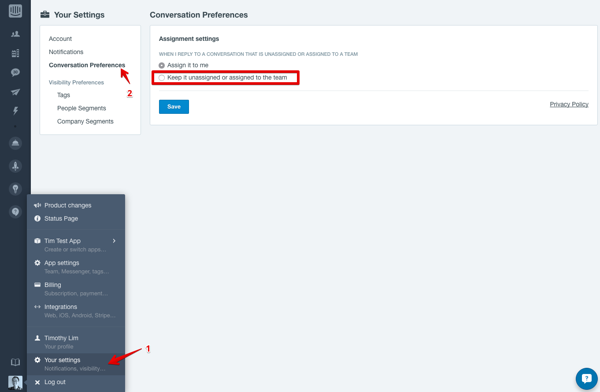
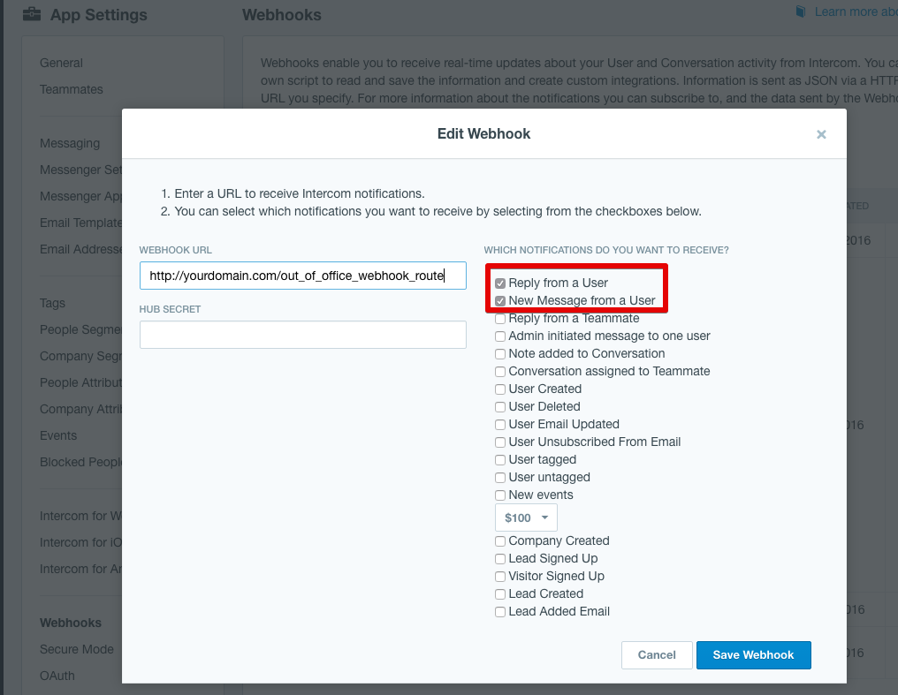

# Intercom Office Hours

- A sample webhook to allow an out of office auto responder in Intercom
- It will only send one message every 24 hours (it does this by creating an internal note with the time of the last response)
- By default it will assume
   - a timezone of UTC
   - with office hours 0900-1700 Mon-Fri

 ## Example

 

## Setup
- [Add a new admin/teammate](https://docs.intercom.io/help-and-faqs/your-team-inbox/how-do-i-add-or-delete-a-teammate) in Intercom for auto responder to come from. You should make it clear to the user that this is a bot
- Ensure that this teammate has a **Conversation Preference** of "Keep it unassigned or assigned to the team" to ensure conversation does not get assigned to this bot

- Deploy this webhook to Heroku with the "Deploy to Heroku button" or on your own servers with the appropriate configuration options in the section below
- Add a webhook to Intercom that subscribes to the appropriate topics. Suggested topics are
   - Reply from a User
   - New Mesage from a User

## Configuration - Environment Variables
- Environment variables are needed for this webhook to work

### Required
- `APP_ID`: your app ID (or personal token)
- `API_KEY`: your API key (blank if using a personal token)
- `bot_admin_id`: admin to send out the auto response

### Optional
- `message`: the message to display to the user
- `timezone`: your timezone e.g. US/Pacific. Currently uses [ActiveSupport timezones](http://api.rubyonrails.org/classes/ActiveSupport/TimeZone.html)
- `days_of_work`: a string of 1 and 0s to indicate the days that you work. Starts from Sunday
    - Default value: `0111110`
- `time_start`: a 24 hour representation of the start of your work day
   - Default value: `900`
- `time_stop`: a 24 hour representation of the end of your work day
   - Default value: `1700`
- `secret`: used for calculating hashes for a signed request
